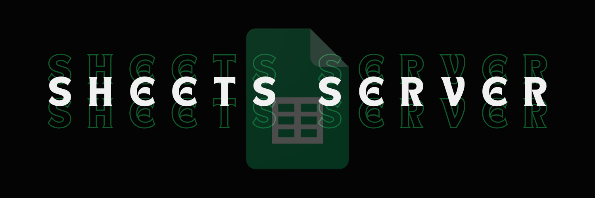

A serverless CMS and Backend runtime built entirely within **Google Apps Script** and **Google Sheets**.

This project demonstrates how to use a Google Spreadsheet as a database and Google Apps Script as a web server to host a fully functional website with dynamic content, real-time chat, and media streaming.

## 🚀 Features

* **Serverless Blog:** Renders posts dynamically from the `Posts` sheet.
* **Real-time Chat:** A functional chat room where messages are stored in the `ChatDB` sheet. Includes a nickname login system.
* **Movie Catalog:** A video streaming interface (`movies` and `watch` routes) fetching metadata from the `Videos` sheet and streaming from Google Drive.
* **Gaming:** Runs **DOOM** directly in the browser using `js-dos` (via the `games` route).
* **Routing System:** Custom `doGet` routing to handle different pages (`home`, `chat`, `movies`, `games`).

## 🛠️ Tech Stack

* **Backend:** Google Apps Script (GAS)
* **Database:** Google Sheets
* **Frontend:** HTML5, CSS3, JavaScript
* **Emulation:** [js-dos](https://js-dos.com/) (for running DOOM)

## ⚙️ Setup & Installation

1.  **Create a Google Sheet:**
    Create a new Google Spreadsheet. This will serve as your database.

2.  **Configure Sheets:**
    Rename/Create the following tabs (sheets) exactly as written:
    * `Posts` (Columns: Date, Title, Content, Slug, Image URL)
    * `ChatDB` (Columns: Timestamp, User, Message)
    * `Videos` (Columns: ID, Title, Description, Cover Image URL, Google Drive ID)

3.  **Open Apps Script:**
    Go to `Extensions > Apps Script` in your spreadsheet.

4.  **Upload Code:**
    * Copy the contents of `code.gs` into the script editor.
    * Create HTML files named `index.html`, `chat.html`, `nav.html`, `movies.html`, `watch.html`, and `games.html`.
    * Paste the respective code into each file.

5.  **Deploy:**
    * Click **Deploy** > **New deployment**.
    * Select type: **Web app**.
    * Execute as: **Me**.
    * Who has access: **Anyone** (or "Anyone with Google account" depending on your needs).

## 📂 Project Structure

* `code.gs`: Main entry point. Handles routing (`doGet`) and database queries (`getPosts`, `saveChatMessage`, etc.).
* `index.html`: Homepage/Blog template.
* `chat.html`: Chat interface with login and auto-refresh.
* `movies.html` & `watch.html`: Video catalog and player templates.
* `games.html`: DOOM emulator integration.
* `nav.html`: Navigation bar component included in all pages.

## 📝 Usage

Access the web app using the deployment URL:

* **Home:** `.../exec?page=home`
* **Chat:** `.../exec?page=chat`
* **Movies:** `.../exec?page=movies`
* **Games:** `.../exec?page=games`
